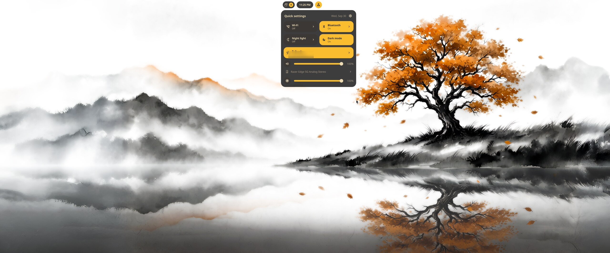
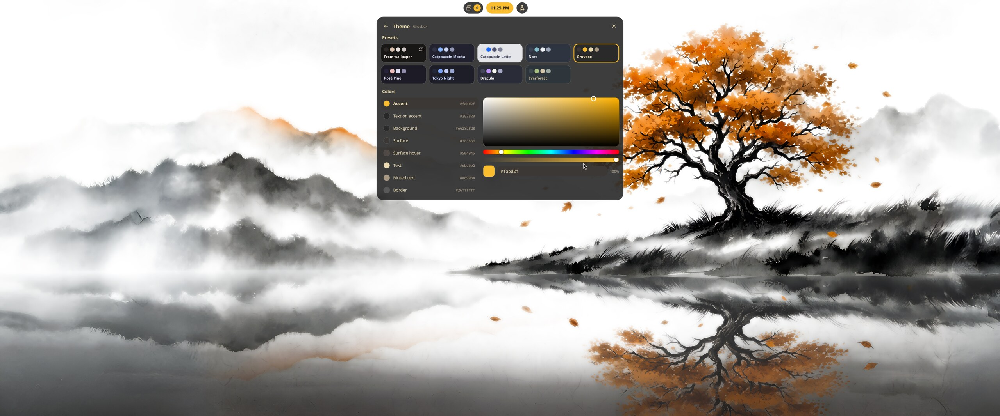
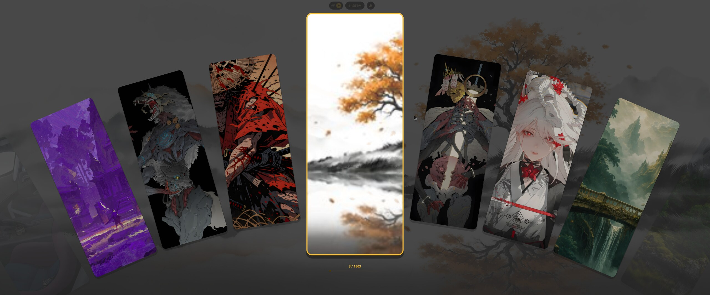
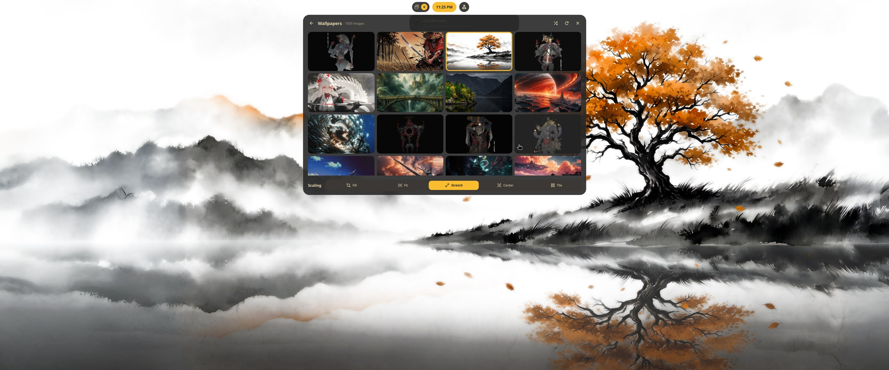
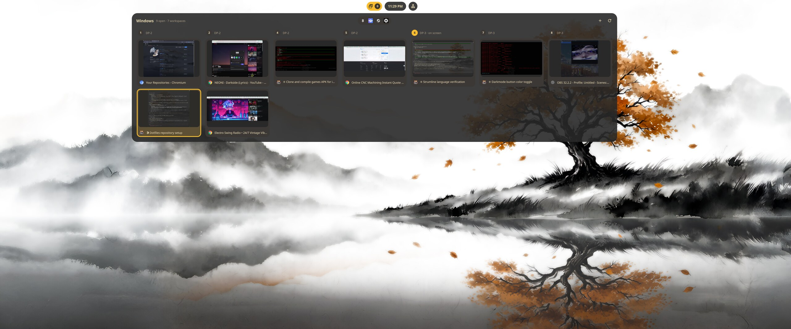
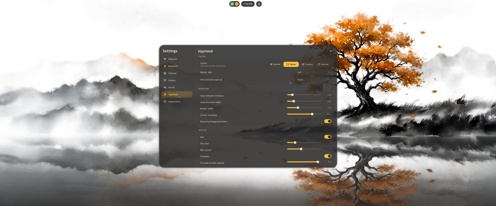

# dotfiles

Hyprland desktop on Arch: a custom Quickshell shell (`base`): island bar, launcher, window overview, wallpaper carousel, live theme picker. The colours come from the wallpaper (matugen) or from a preset, and they flow through to kitty, GTK, Qt/KDE and the lock screen.


| | |
|---|---|
|  **Launcher**: tap Super. Apps + files under `~`. |  **Quick settings**: Wi-Fi, Bluetooth, night light, dark mode, Tailscale, volume, brightness. |
|  **Dashboard**: media card with a source picker, plus wallpaper and theme cards. |  **Theme picker**: From wallpaper, Catppuccin, Nord, Gruvbox, Rosé Pine, Tokyo Night, Dracula, Everforest, or a custom palette. |
|  **Wallpaper carousel**: `Super+Alt+W`. |  **Wallpaper picker**: a grid with scaling modes. |
|  **Window overview**: `Super+Tab`. Live thumbnails by workspace, drag windows between workspaces, keyboard navigation. |  **Settings**: network, Bluetooth, display, sound, and live Hyprland tweaks (layout, gaps, rounding, blur). |

## What's in here

| Path | What |
|---|---|
| `.config/quickshell/base/` | The shell: bar, launcher, overview, notifications, OSD, settings. See its `README.md`. |
| `.config/quickshell/end4-pC/` | Fork of [end4's dots](https://github.com/end-4/dots-hyprland) ([pctrade/end4-pC](https://github.com/pctrade/end4-pC)). `base` uses its `switchwall.sh` to set wallpapers and regenerate the matugen colours. GPL-3.0. |
| `.config/hypr/` | Hyprland **Lua** config: animations, decoration, rules, keybinds, hyprlock, hypridle. Your own overrides go in `custom/`. |
| `.config/matugen/` | Wallpaper → Material colour templates for Hyprland, hyprlock, fuzzel, GTK, KDE and the shell. |
| `.config/kitty`, `fish`, `starship.toml`, `fastfetch` | Terminal + prompt. kitty picks up the shell's palette live. |
| `.config/gtk-3.0`, `gtk-4.0`, `Kvantum`, `kdeglobals`, `darklyrc`, `fontconfig` | Toolkit theming. |
| `.config/fuzzel`, `btop`, `cava` | Themed extras. |

## Keybinds (shell)

| Keys | Action |
|---|---|
| `Super` (tap) | Launcher |
| `Super+Tab` | Window / workspace overview (drag-and-drop between workspaces) |
| `Super+Alt+W` | Wallpaper carousel |
| `Super+Alt+←/→` | Previous / next wallpaper |
| `Super+J` | Toggle bar |
| `Super+Return` | kitty |

The rest of the binds come from end4's defaults in `hypr/hyprland/keybinds.lua`.

## Install

Dependencies (Arch): `hyprland` (a version with the Lua config), `quickshell`, `matugen`, `kitty`, `fish`, `starship`, `eza`, `fastfetch`, `fuzzel`, `fd`, `cliphist`, `wl-clipboard`, `hyprsunset`, `ddcutil`, `grim`, `ffmpegthumbnailer`, `bluez-utils`, `adw-gtk-theme`, `kvantum`, `darkly`, `ttf-jetbrains-mono-nerd`, `ttf-material-symbols-variable`, and `bibata-cursor-theme` from the AUR. end4-pC has its own dependency list in its README.

```bash
git clone https://github.com/Krodity/dotfiles ~/Dotfiles
~/Dotfiles/install.sh   # copies into ~/.config and backs up anything it replaces
```

Then:
1. Set your monitors in `~/.config/hypr/custom/general.lua`.
2. Put wallpapers in `~/Pictures/Wallpapers`.
3. Log into Hyprland. The shell starts from `hypr/hyprland/execs.lua` (`qs -c base`).

## Notes

- Machine-specific parts were scrubbed out or replaced with templates: monitor layout, per-game rules, app launchers, personal scripts, file paths and network details. `templates/` holds the cleaned `hypr/custom/` files.
- `sync.sh` rebuilds this repo from a live `~/.config`. It runs the scrub and refuses to finish if anything personal is left.
